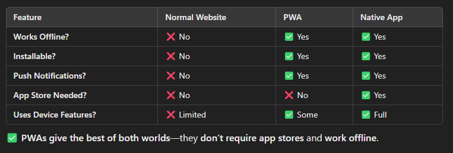

# Progressive Web Apps (PWA)

## What is a PWA?

- A PWA is a website that feels like an app.

- It works on any device (mobile, tablet, or desktop).

- No need to download from an app store—just open the website and install it.

- PWAs work offline, load fast, and can send push notifications.

## Why were PWAs created?

- People spend more time on apps than on websites.

- But downloading apps is a hassle—many users don’t want to install them.

- PWAs remove friction—just open the site, and it's ready to go.

- They are cheaper and easier to maintain than native apps (iOS/Android).

## Features of a PWA

A PWA is different from a normal website because it has:

- **Works on Any Device** – Responsive design, looks good on mobile & desktop.

- **Fast & Smooth** – Pages load instantly, even on slow networks.

- **Works Offline** – Caches pages so they open without the internet.

- **Installable** – Users can add it to their home screen like an app.

- **Secure** – Always served over HTTPS to protect data.

- **Push Notifications** – Can send updates like a native app.

- **Updates Automatically** – No need to update manually like a native app.

## Key Technologies That Make a PWA Work

### 1. Service Workers (The Brain of a PWA)

- A Service Worker is a JavaScript file that runs in the background.

- It handles caching so pages load even without the internet.

- It intercepts network requests—meaning it can decide what to load from the cache or fetch from the internet.

- It also enables push notifications and background sync.

🔹 Example:
You open a PWA with the internet → The Service Worker saves some files.
Next time you open it without the internet → The Service Worker loads the saved files instead of showing an error.

### 2. Web App Manifest (Makes a PWA Installable)

- A manifest.json file tells the browser how the PWA should look when installed.

- It contains:

  - App Name – The name of the app.
  - Icons – The app icon for the home screen.
  - Theme Color – Custom colors for a native feel.
  - Start URL – The page the app should open when launched.
  - Display Mode – Can be fullscreen, standalone (no browser UI), or minimal UI.

- Generate Manifest:
  [https://app-manifest.firebaseapp.com/](https://app-manifest.firebaseapp.com/)

- How to add manifest.json in code:
  

- The manifest.json file should be in public folder in order to access it.

### 3. HTTPS (Security Requirement for PWAs)

- PWAs must be served over HTTPS for security reasons.

- This ensures data encryption and protects against hacking attempts.

- Without HTTPS, Service Workers won’t work.

- Exception: You can test locally without HTTPS (localhost).

### 4. PWA vs Normal Websites vs Native Apps

### 5. Real-World Examples of PWAs

- Twitter Lite – 70% less data usage, 65% more pages viewed.

- Pinterest PWA – 60% more engagement.

- Starbucks PWA – Works offline, smaller than native app.

- Uber PWA – Loads in 2 seconds, even on 2G networks.

### 6. Example Project Weather PWA App

[https://weather-app-pwa-demo.vercel.app/](https://weather-app-pwa-demo.vercel.app/)

## Common Questions about PWA

### 1. How do Service Workers update?

- The old Service Worker keeps running until all pages close.

- When the user reopens the app, the new version replaces the old one.

### 2. Can PWAs use phone features like GPS, camera, or Bluetooth?

Yes! PWAs can access:

- Camera (navigator.mediaDevices.getUserMedia).

- GPS (navigator.geolocation.getCurrentPosition).

- Bluetooth (navigator.bluetooth.requestDevice).

⚠️ But some features (Face ID, fingerprint scan) are not allowed.

### 3. Do PWAs work on iOS and Android?

✅ Android: Full PWA support (installable, push notifications, offline mode).

⚠️ iOS: Limited support (before iOS 16.4, no push notifications).

### 4. Why Should Businesses Use PWAs?

- Lower Development Cost – No need for separate iOS/Android apps.

- Faster Performance – Loads instantly, works on low-end devices.

- Higher Engagement – Users return because of push notifications.

- No App Store Needed – No approval delays, instant updates.
